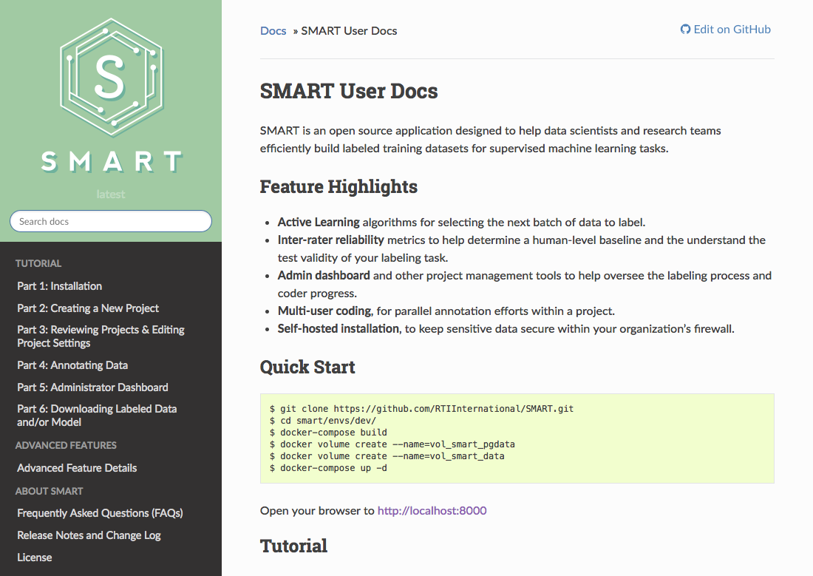

### SMART User Documentation

**[READ THE DOCS ONLINE](https://smart-app.readthedocs.io/en/latest/)**



Using [Sphinx](http://www.sphinx-doc.org/en/master/) to create the user documenation for SMART and hosting on [Read the Docs](http://docs.readthedocs.io/en/latest/index.html) (TBD).  For a theme template, we're using the [Read the Docs Sphinx Theme](https://sphinx-rtd-theme.readthedocs.io/en/latest/index.html).

**Edit and Build**

To modify any of the existing pages, (for example, `index.rst`) navigate to the file and modify the documentation.  Project configuration setting can be found in `conf.py`.

To build the docs after adding edits, navigate back to the root directory and type:

```$ make html```

To open the newly created html page:

``$ open nbuild/html/index.html``

**Resources**

* [Sphinx Tutorial](http://docs.sphinxdocs.com/en/latest/index.html)
* [reStructuredText cheat sheet](http://docs.sphinxdocs.com/en/latest/cheatsheet.html)
* ["Getting Started" screencast](https://www.youtube.com/watch?v=oJsUvBQyHBs&feature=youtu.be)