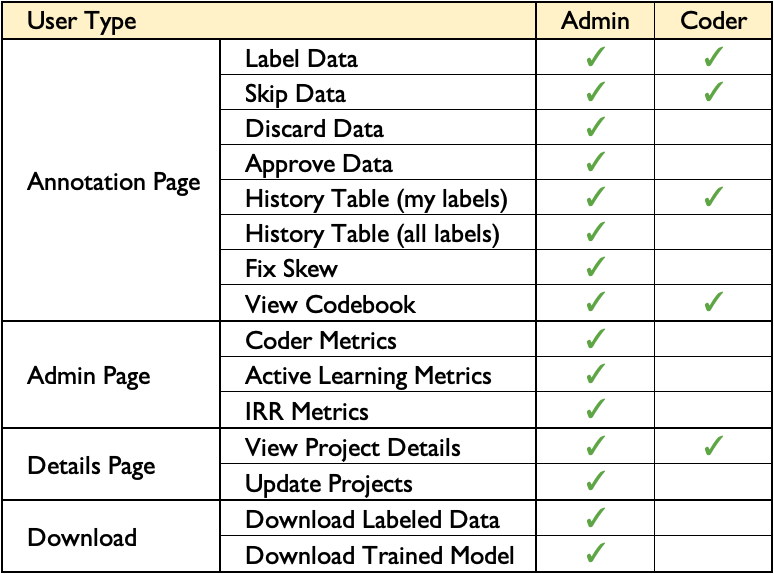

Frequently Asked Questions (FAQs)
=================================

General Questions
-----------------

What does SMART stand for?
**************************

SMART stands for "**S**\ marter **M**\ anual **A**\ nnotation for **R**\ esource-constrained collection of **T**\ raining data", an acronym so contrived that it qualifies as both a `backronym <https://en.wikipedia.org/wiki/Backronym>`_ and a `recurvise acronym <https://en.wikipedia.org/wiki/Recursive_acronym>`_.

What was the genesis for SMART?
*******************************

The creation of SMART stems directly from a data-focused business problem that the core development team encounter repeatedly at `RTI International <https://www.rti.org/>`_; projects that could greatly benefit from having a well trained supervised ML classifier often don't yet have the labelled data to build one. From our experience as practicing data scientists and researchers, the data annotation effort can be particularly arduous in the social science and public health domains where the underlying categories are difficult for humans to categorize and/or are ambiguous. Several of our projects utilizing social media, online news articles, legaslative texts, etc. require careful coordination with project staff or crowdsourced workers to get labelled data that is timely and reliable. SMART was a means to help make this process more efficient, especially in cases where using a crowdsourcing platform isn't possible (e.g., when the data is proprietary or sensitive in nature).

More generally, building labeled data sets is also a commonly reported bottleneck for groups doing applied data science and machine learning in both research and industry.  With generous support from the `National Consortium for Data Science <https://datascienceconsortium.org/>`_ and `RTI International <https://www.rti.org/>`_, we were able to build SMART as an open source project to share with the larger data science and applied ML community.

Can I add or remove new class labels after a project is created?
****************************************************************

SMART does not allow users to add, remove, or modify class labels after a project is created. This is mainly to prevent awkward interactions with the active learning models. For example, the model evaluation metrics and their associated visualizations become difficult to compare if class definitions are frequently changing. 

That being said, we recognize that determining meaningful categories for a new labeling project can be non-trivial. To help users iterate during early-stage labeling projects when model categories are still being decided, we support exporting labeled data from any existing projects and recommend creating a new project (with modified codebook, label descriptions, etc.) to provide a clean annotation experience for your coding team.

I accidentally mislabeled an observation. How do I correct my mistake?
***********************************************************************

If you accidentally mislabel a document during the coding process, you can re-label the observation in the "History" tab of the annotation page. Re-labelling is only unavailable if the data was used for IRR and was either resolved due to coder agreement, or an Admin provided a final label after coder disagreement.

.. warning::
	When using active learning, data labels modified on the History tab will not change the model accuracy metrics of past batches displayed on the Active Learning tab of the Admin page, but instead, will update the data for the next model re-training.

What functionality do I get as a Coder? Admin?
**********************************************

.. _userroles:

SMART has two levels of user: ``coder`` and ``admin``. The following chart summarizes what operations are accessible to what level of user:

|user-roles|

Technical Questions
-------------------

What kinds of supervised ML tasks does SMART support?
******************************************************

As of this version, SMART only supports text classification tasks. However, we hope to extend the platform to support other types of media (images, video, etc.), and perhaps other types of modeling tasks beyond classification in future releases.

What features underly the active learning models?
**************************************************

Currently, SMART uses a term frequency inverse document frequency (TF-IDF) matrix to structure text data. Other popular representations (embeddings, pre-trained language models, etc.) are not currently available in SMART but are welcome additions in future releases.

Can I code for multiple text classification tasks at the same time?
*******************************************************************

The only way currently to annotate for multiple modeling tasks is to create multiple projects (one for each task). Though multi-task active learning (learning how to select observations that best jointly learn multiple modeling tasks simultaneously) is an exciting area of research, there are not plans for supporting it in the near future.

Do I have to use Active Learning, IRR, etc.?
********************************************

Depending on your modeling goals, many of the options provided in SMART (active learning, IRR, etc.) may be unnessary or overkill for your use case. To allow users to customize their data labelling experience, users are encouraged to add or remove project features in the Advanced Settings page during project creation.

What are the metrics on the Active Learning page?
*************************************************

The model evaluation metrics presented on the Active Learning section can help you and your team diagnose how a model is performing as more data is labelled. Definitions for the classification evaluation metrics can be found in the :ref:`active-learning` section of the :doc:`features` page.

What active learning strategies does SMART support?
***************************************************

The active learning strategies implemented in SMART can be found in the :ref:`active-learning` section of the :doc:`features` page.

Why support labeling data in batches?
*************************************

We implemented an option to label data in batches due to its practicality. While many active learning strategies assume a sequential back-and-forth between the model and the labeller, waiting for the model to train and predict new examples after every new labeled observation can be prohibitively slow when models are complex or when the underlying data set is large. Additionally, labeling observations in batches more easily allows the labeling process to be spread out among multiple people working on a batch in parallel.

To provide assistance for just this scenario, researchers have developed *batch-mode active learning* algorithms that help assemble batches containing both informative and diverse examples, reducing the chance that observations within a batch will provide redundant information.  While effective on large batch sizes, initial tests comparing batch-mode active learning models against simpler non-batch active learning strategies showed similar performance on more modest batch sizes **[link to notebook]**.  Due to the complexity of many batch-mode active learning models and similar performance on smaller batch sizes, we forego including batch-mode active learning models in the initial release.

Is the model used to generate embeddings the same as the classifier SMART iteratively trains?
*********************************************************************************************

No, while a model is also used to generate embeddings, they are static and do not update as more items are labeled. 

Can I customize the label embeddings?
*************************************

Yes you can! SMART saves the embeddings model it uses in the `smart_embeddings_model folder <https://github.com/RTIInternational/SMART/tree/master/backend/django/core/smart_embeddings_model>`_. 
Depending on the subject domain, you might want to update your model to associate certain phrases as being similar or dissimilar if they are uncommonly used outside of your field. 

You can update the SMART embeddings model using the `csv to embeddings model repository <https://github.com/RTIInternational/csv-to-embeddings-model>`_.

What's the tech stack used to build SMART?
******************************************

It consists of a Django web application backed by a Postgres database and a Redis store.  The application uses Docker in development to aid in dependency management.

