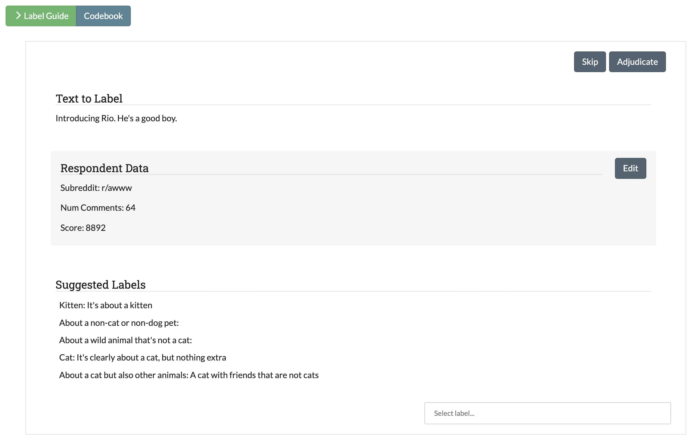

Advanced Feature Details
========================

.. _active-learning:

Active Learning
---------------

What is Active Learning?
************************

The process of creating annotated training data for supervised machine learning models is often expensive and time-consuming. **Active Learning** is a branch of machine learning that seeks to minimize the total amount of data required for labeling by strategically sampling observations that provide new insight into the problem. In particular, *Pool-based Active Learning* algorithms seek to select diverse and informative data for annotation (rather than random observations) from a pool of unlabeled data. Active learning algorithms are a cornerstone of the SMART platform, allowing users to utilize these methodologies with minimal costs to projects.

Due to the lack of a universal "one size fits all" active learning algorithm, SMART provides a number of options, allowing users to select the configuration that works best for their situation. Additionally, the first batch is always chosen randomly, both because there must be sufficient training data for Active Learning to work and to mitigate initial bias.

To learn more about active learning, read Settles (2010) [#settles]_ for an excellent survey of the active learning literature.

Enabling Active Learning in SMART
*********************************

Users can enable active learning and select the method for measuring uncertainty in the Advanced Settings page when creating a new project (see :ref:`advancedsettings` for more details).

As of this release, SMART supports **Uncertainty Sampling** with three different measures of uncertainty: *Least Confident*, *Margin*, and *Entropy*. Uncertainty Sampling works by training the model on the existing labeled data and then calculating the probability that each piece of unlabeled data belongs to each possible label. The algorithm returns the most "uncertain" data to be correctly labeled by the coders. The algorithm uses one of three methods to select the unlabeled data that the classifier is the most "uncertain" about:

* **Least Confident** (default): The algorithm chooses the data with the lowest probability for the most likely label using the equation:

	.. math::
		\DeclareMathOperator*{\argmax}{arg\,max} 
		x_{LC}^* = \argmax_x 1 - P_\theta(\hat y \vert x)

	where:

	.. math::
		\hat y = \argmax_y P_\theta(y \vert x)

* **Margin Sampling**: The algorithm chooses the data with the smallest difference between the probability of the most likely and least likely labels using the equation:

	.. math::
		x_{M}^* = \argmax_x [P_\theta(\hat y_2 \vert x) - P_\theta(\hat y_1 \vert x)]

	where: 

	 ``yhat_1`` and ``yhat_2`` are the first and second most likely predictions under the model.

* **Entropy**: The algorithm chooses the most uncertain or "disordered" data by taking the data with the highest score for the entropy equation:

	.. math::
		x_{H}^* = \argmax_x -\sum_y{P_\theta(\hat y \vert x) * \log P_\theta(\hat y \vert x)}

	where:

	 ``y`` ranges over all possible labelings of ``x``.

.. _almetrics:

Active Learning Metrics
***********************

An important consideration in active learning is model performance. To assess your models as your team labels data, SMART provides the following classification model evaluation metrics in the Active Learning Model page of the Admin dashboard:

* **Accuracy**: proportion of observations that the model correctly labeled.

.. math::
	\frac{TP + TN}{TP + FN + TN + FP}

* **Precision**: Indicates how precise the model is at correctly predicting a particular category.

.. math::
	\frac{TP}{TP + FN}

* **Recall**: Indicates how comprehensive the model is at identify observations of a particular category.

.. math::
	\frac{TP}{TP + FP}

* **F1-score**: the harmonic mean of Precision and Recall.

.. math::
	2\cdot \frac{(Precision \cdot Recall)}{Precision + Recall}

where:

``TP`` = True Positive, ``FP`` = False Positive, ``TN`` = True Negative, ``FN`` = False Negative

.. _irr:

Inter-rater Reliability (IRR)
-----------------------------

What is IRR?
************

SMART is designed to support labeling projects that may utilize many labelers. When many coders are working on a project, it becomes crucial that coders agree on what labels should apply to what data. Inter-rater Reliability (IRR) is a set of metrics that measures how consistently coders agree with each other, and it is common for a labeling project to require a minimum score for a particular IRR metric for the data to be deemed usable. IRR metrics are calculated from having coders label the same data and examining the results.

Enabling IRR in SMART
*********************

Project creators can enable IRR in their SMART projects through the :ref:`advancedsettings` page of project creation. Once IRR is enabled, two additional settings are available:

1. *The percentage of a batch that will be IRR* -- This number signifies how much of the data per batch will be used to calculate IRR metrics. This data must be either labeled or skipped by a minimum number of coders before it can be processed.
2. *The minimum number of coders participating in IRR activities* -- This number signifies the minimum number of coders that would need to either skip or annotate a piece of IRR data before it can be processed.

As an example, if a project creator chooses 100% for the percentage of the batch that will be IRR and 3 for the minimum number of coders participating in IRR activities, all data in each batch would be required to be labeled by three coders before it could be processed.

.. tip::

		Setting the percentage to 0% is the same as disabling IRR.

IRR Data Flow
*************

If the project creator has enabled IRR, additional steps are added to the data pipeline. First, when the project provides a batch of unlabeled data to label, the previously specified IRR percentage is taken out and marked as IRR. 
When a user opens the annotation page to begin labeling, SMART first checks if there is any IRR data that SMART has not yet seen. This data is pulled first, and the rest of the deck is filled with non-IRR data. This deck is then shuffled before being presented to the user to make it harder to know what data is IRR. SMART tracks what IRR data has been labeled/sent for adjudication by which users. 
"Sent to adjudication" is automatically recorded in the internal IRR Log table, while labels are placed in the same label table as non-IRR data (though the training set will not incorporate them as they are marked IRR). Once IRR data has enough people either code it or send it to adjudication, two outcomes can happen:

1.	If everyone labeled the datum and these labels were the same, then the datum is added with the agreed upon label to the training set.
2.	If any coder sent the datum for adjudication, or coders disagreed on the label, the datum is sent to the admin table for the final label.

After a datum is processed, the labels from all coders are recorded in the IRR Log table.

.. note::
	* If an admin chooses to discard an IRR datum as unusable, all records of this datum will be flushed from the IRR Log table.

IRR Metrics
***********

To evaluate the reliability of coders, several metrics are calculated for the project admins. This includes percent overall agreement (how many often did everyone give the same label), pairwise percent agreement (how much did two users in particular agree), and a heat map showing the frequency where one coder chose label A and another chose label B (see :ref:`irrpage` for more information). In addition, SMART provides a kappa score, which is a common IRR metric. The kappa score comes from one of the two types below:

.. _cohenskappa:

Cohen's kappa
~~~~~~~~~~~~~

This metric is used when there are two coders. Cohen's kappa is most commonly used for categorical items [#cohenswiki]_.
The general formula is:

.. math::
	\kappa = \frac{p_o - p_e}{1 - p_e} \\

where

.. math::
	p_o = accuracy \\
	p_e = \frac{1}{N^2}\sum_k{n_{k1}n_{k2}}

and where ``N`` is the number of data points, ``k`` represents the number of possible labels, and ``n`` is a matrix of label counts of category by labeler (or how many times did each coder choose each label) [#cohenswiki]_.

p\ :sub:`e` is the hypothetical probability of agreeing by chance. 

.. _fleissskappa:

Fleiss's kappa
~~~~~~~~~~~~~~

This metric is the counterpart to Cohen's kappa for more than three coders. The formula is the ratio between the degree of agreement that is attainable above chance, and the degree of agreement actually achieved [#fleisswiki]_.
The general formula is:

.. math::
	\kappa = \frac{\hat{P} - \hat{P_e}}{1 - \hat{P_e}}

.. math::
	\hat{P} = \frac{1}{N} \sum_{i=1}^N{(\frac{1}{l(l-1)} * \sum_{j=1}^k{n_{ij}(n_{ij} - 1)})}

.. math::
	\hat{P_e} = \sum_{j=1}^k{(\frac{1}{l(N)} * \sum_{i=1}^N{n_{ij}})}

Where ``N`` is the number of data points, ``k`` represents the number of possible labels, ``l`` is the number of labels for each piece of data, and ``n`` is a matrix of data points by the number of votes per label [#fleisswiki]_.

.. _fix-skew:

Fix Skewed Label Distributions
------------------------------

In many applied settings, the distribution of categories the user may be interested in labelling is not well balanced.  In particular, if one or more categories of interest occur rarely, labeling observations at random will be particularly inefficient and can quickly exhaust a project's labelling budget. To help combat this issue, SMART implements a version of the *guided learning* strategy outlined in Attenberg and Provost (2010) [#attenberg]_.  This approach treats active learning as a search problem, allowing the user to utilize prior context to identify relevant observations of the rare category, effectively initializing the training batch with a set of relevant rare examples. Findings in Attenberg and Provost (2010) [#attenberg]_ indicate an 8x reduction of real annotation cost per instance using this method on imbalanced data sets when compared to other active learning strategies studied.

See :ref:`fixskew` for more information on using this feature.

.. _label-embeddings:

Label Embeddings
----------------

For projects with more than 5 labels, SMART automatically generates embeddings of the labels and their descriptions. 
When a user goes to code items, SMART will present the top five label categories based on the cosine similiarty between the text and label embeddings.

|annotate-cards|

.. _embeddings-define:

What are Text Embeddings?
*************************

A text embedding is a numerical representation of text which can be used for many downstream use cases.
At its most basic, a text embedding could be a vector of length N where each dimension is the number of times a specific word appears in the text (i.e., a `bag-of-words <https://en.wikipedia.org/wiki/Bag-of-words_model>`_ model). 
However, more advanced deep learning methods that do not rely solely on term counts have been shown to be able to effectively capture the semantic meaning of text. 
For example, two sentences could be deemed similiar if they convey similiar meaning, even if they use completely different words.

SMART uses a version of MPNet model [#song]_ from the `sentence-transformers <https://www.SBERT.net>`_ library to generate embeddings, mapping input documents and label text to 384 dimensional dense vectors. 

.. [#settles] Settles, B. (2012). Active learning. Synthesis Lectures on Artificial Intelligence and Machine Learning, 6(1), 1-114.

.. [#cohenswiki] https://en.wikipedia.org/wiki/Cohen%27s_kappa

.. [#fleisswiki] https://en.wikipedia.org/wiki/Fleiss%27_kappa

.. [#attenberg] Attenberg, J., & Provost, F. (2010). Why label when you can search?: Alternatives to active learning for applying human resources to build classification models under extreme class imbalance. In Proceedings of the 16th ACM SIGKDD international conference on Knowledge discovery and data mining (pp. 423-432). ACM.

.. [#song] Song, K., Tan, X., Qin, T., Lu, J., & Liu, T. Y. (2020). Mpnet: Masked and permuted pre-training for language understanding. Advances in Neural Information Processing Systems, 33, 16857-16867.
