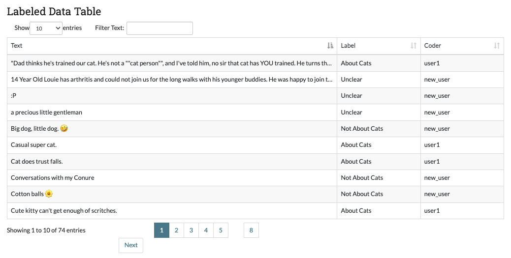
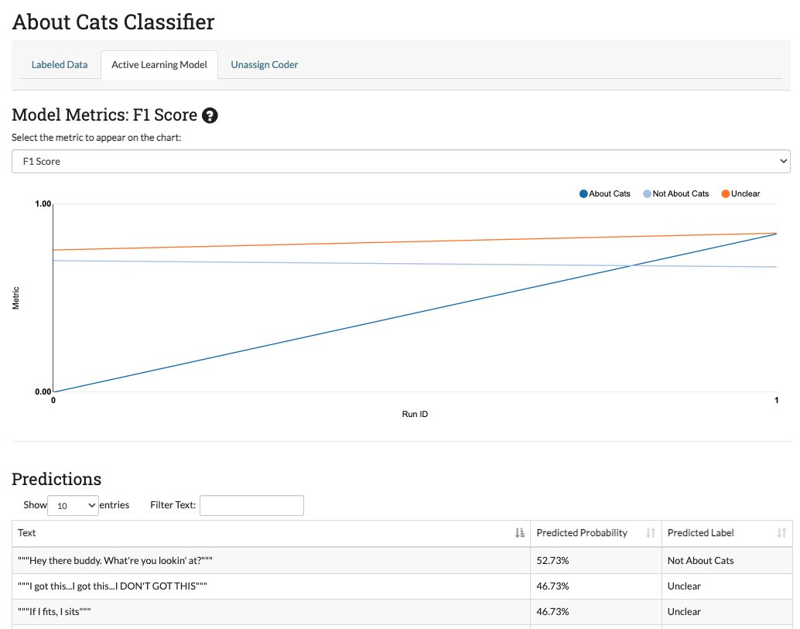
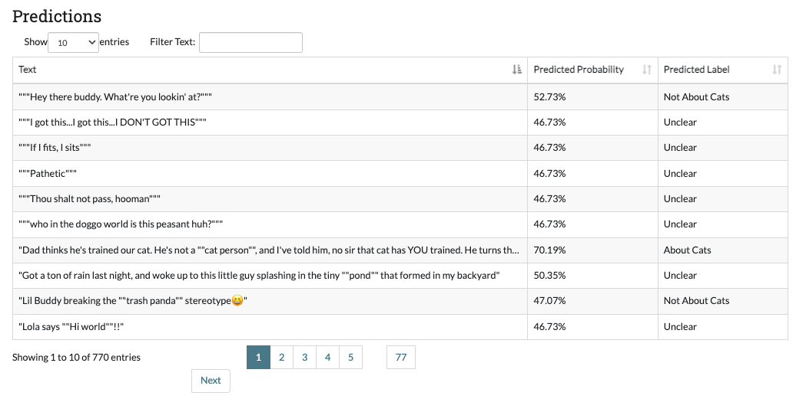
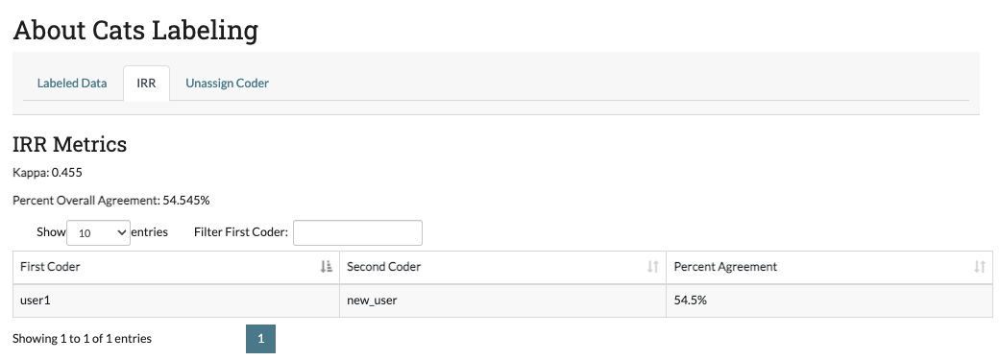
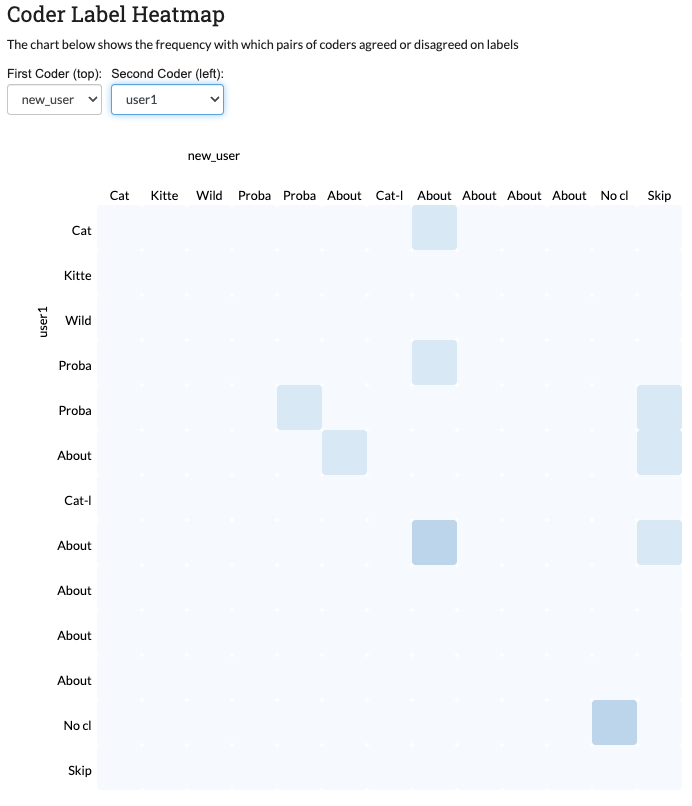

.. _admindashboard:

Part 5: Administrator Dashboard
===============================

If you are a project admin, you may want some way to keep track of how your project is doing. The administrator dashboard allows users with admin privileges track their project's progress. Depending on the project settings, this page will have one, two, or three tabs to let them track different aspects of the project. Each of the sections below specifies what projects they apply to.

Each of the Administrator Dashboard tabs includes a table. These tables can be filtered using the text box at located at the top right. They can also be sorted by column by clicking on the column header (exactly as with the :ref:`annotation page tables <searchingandsorting>` but instead of a grey bar there is an arrow and stair icon).

|admin-sorting|

.. _labeleddatapage:

Labeled Data Page
-----------------

**Visible for all projects**

The labeled data page is designed to provide a summary of how the coders are doing comparatively in terms of speed and label distribution. There are three main features of the page:

* The bar chart on the top left permits project admin to compare at a glance how many items coders have labeled and the distribution of the labels for each coder. This lets admin see which users are labeling more and detect possible overuse or underuse of labels by particular users.
* The box and whisker chart on the top right lets project admin see how long each coder is taking to annotate the data.  This helps admin detect coders who may be having trouble or coders who are simply clicking through their data.

|annotate-admin-labeled-pagetop|

* The Labeled Data table at the bottom of the page contains all data that has been officially assigned a label. The table includes a snippet of the text, the assigned label, and the user responsible for the label. This lets admin see how much data has been collected in total so far, and get a sense for their labeled data without :ref:`downloadmodel`.

|annotate-admin-labeled-table|

.. _modelpage:

Active Learning Model Page
--------------------------

**Visible for projects with a model**

The model page lets project admin track how well the classifier trained on their labeled data is performing. After each batch of data is labeled, the model retrains on the entire labeled data set. The model page has two main parts:

* **The model metrics chart:** This chart shows the change in model accuracy, F1 score, Precision, or Recall (see :ref:`almetrics` for more information) after each successive batch is labeled. These scores are calculated by running five-fold `cross validation <https://en.wikipedia.org/wiki/Cross-validation_(statistics)>`_ on the labeled data. You can change which metric is being displayed using the dropdown above the chart. You can also get a formal definition of the displayed metric by hovering over the (?) symbol next to the title.

|annotate-admin-model-pagetop|

* **The prediction table:** (*only for projects using active learning*) Each time a model is run, SMART then predicts the likelihood of the unlabeled data belonging to each class. The Predictions table shows the label with the highest probability for each unlabeled piece of data. If your project uses Uncertainty-based Active Learning (entropy, margin, or least confident), then the data in the table with lower probabilities (the data where the model is the most "uncertain") is more likely to be chosen for the next batch.

|annotate-admin-model-predictions|

.. _irrpage:

IRR Page
--------

**Visible for projects that are using IRR**

The Inter-Rater Reliability (IRR) page lets admin explore the results of having multiple users label the same data (see :ref:`irr` for a full explanation of IRR). The IRR tab includes four parts:

* **Kappa:** The first value below the IRR Metrics Title is a kappa score. This is a common metric for evaluating IRR. This score is calculated using :ref:`cohenskappa` if the number of required coders is two, and :ref:`fleissskappa` if the number of required coders is higher than two.
* **Percent Overall Agreement:** The next value below the kappa gives the percent of IRR data where all coders agreed (note that everyone skipping it does not count as agreement).
* **Pairwise Percent Agreement Table:** Below the numeric metrics, a table is provided with the percent agreement between each pair of coders. In the case where a particular pair has never coded the same IRR data (since there may be more coders on a project then required for IRR), the message "No samples" is displayed.

|annotate-admin-irr-pagetop|

* **Coder Label Heatmap:** The pairwise relationship in the pairwise percent agreement table can be explored in more detail in the Coder Label Heatmap. An admin can examine how often two coders agreed or disagreed on a label and pinpoint areas of disagreement between coders. You can select two coders to compare using the two dropdowns labeled ``First Coder (left)`` and ``Second Coder (top)`` above the chart. The legend on the bottom of the chart corresponds to the number of pieces of data involved.

|annotate-admin-irr-heatmap|

If you select two coders with no samples between them, the heat map will not display:

|annotate-admin-irr-heatmapnosamples|

.. |admin-sorting| image:: ./nstatic/img/smart-admin-sorting.png

.. |annotate-admin-irr-heatmapnosamples| image:: ./nstatic/img/smart-admin-irr-heatmapnosamples.png
