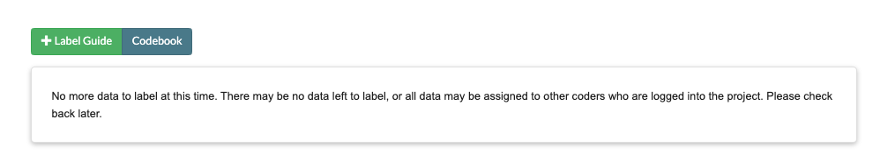
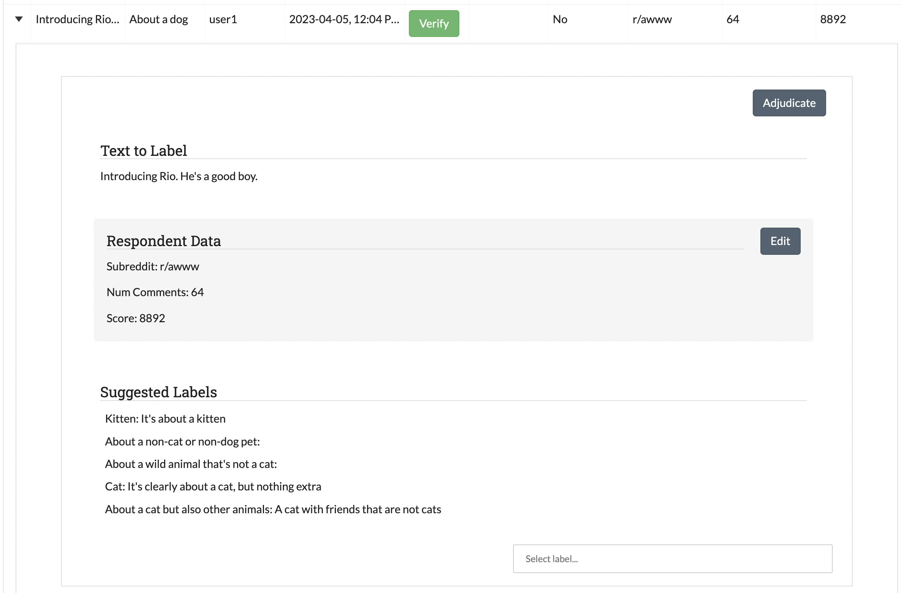
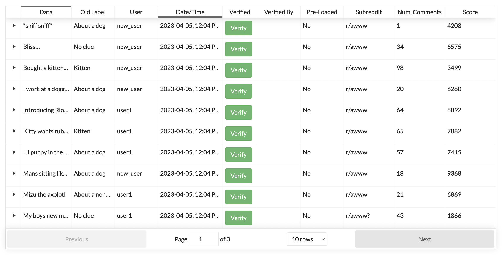

Part 4: Annotating Data
=======================

Once your project has been created, you are ready to start labeling! To begin, you can navigate to any project Annotation page from the :ref:`Projects Page <projects>` or to a specific Annotation page by pressing the "Annotate" link on the top navigation bar when on a project :ref:`details` or :ref:`Admin Dashboard <admindashboard>` page.

The Annotate page consists of either two or five tabs, depending on your User permissions. The sections below are marked by either ADMIN (available only to those with admin privileges) or ALL (available to everyone with at least coder privileges).

.. note::

	If a user with admin privileges is on the annotation page, then other admin will be unable to access admin-only tabs until the first admin has left the page. 
	This is to prevent multiple admin from labeling the same data simultaneously. 
	However, if the first Admin has had at least **15 minutes** of inactivity, the second Admin will be given the page and the first Admin will be locked out. 
	This is to prevent the page from remaining locked due to someone leaving a tab open. Coders and Admin can always access the Annotate Data and History pages. See :ref:`user-roles <userroles>` for a chart of user permissions.

In addition, each tab has access to the project's :ref:`labelguide` and :ref:`codebook` using the buttons shown below:

|annotate-labelguidebuttons|

.. _annotationpage:

Annotate Data Page
------------------

Overview
~~~~~~~~

**User: ALL**

The Annotate Data tab is where most users will spend a majority of their time. When you enter this page, SMART will pass you a portion of the current batch as a deck of "cards", to be presented to you one at a time. You can then choose one of two actions:

* **Label**:
	* *For projects with at most five labels*: Assign a label to the observation by clicking on the button corresponding to the desired label. 
	* *For projects with more than five labels*: Assign a label to the observation by either clicking on one of the suggested labels (see :ref:`label-embeddings` for more information on label suggestions), or by searching for the correct label in the dropdown.
* **Skip**: This option is used when you want to skip an observation for now. This will send it back into the pool of data to label.
* **Adjudicate**: This option is used when you are unsure of what label to choose or you want to send an observation to the project administrators for review. When selecting this option, you will be required to provide a reason why you are sending the item to the administrators. Data that is not IRR is sent to the :ref:`adminannotate` to be reviewed by any user with admin privileges. Data that is IRR will still need to wait for the required number of coders to weigh in (adjudicating counts as your label).
* **[NEW] Edit Metadata**:Clicking the "Edit" button allows you to edit the values for the metadata fields for that card. This option is also available in the History and Skew tables. This allows users to record additional information about their data in metadata fields, or fix incorrect values.

If the data is not being used for :ref:`irr` and is labeled, then this data will be marked as labeled and removed from the pool of unlabeled data. If data is IRR, then it may still be presented to additional coders on the project, but will not be presented to you again.

Below we have an annotate page for the "About Cats Labeling" project.

|annotate-cards|

Below, we see an example of the card above after the "edit" button has been pressed

|edit-metadata|

.. _batchrefilling:

Refilling the Batch
~~~~~~~~~~~~~~~~~~~

A user's card deck will continue to refill itself from the batch until it is empty. Once a batch has been coded or skipped, a new batch of unlabeled data will be requested from SMART. This batch will be selected using the chosen active learning algorithm, or randomly, depending on if Active Learning was enabled in :ref:`advancedsettings`. The batch may also be selected randomly in projects with active learning enabled for three other reasons:

* It is the first batch
* Each possible label has not been used at least once
* There has not been a full batch worth of data marked as labeled (possibly some was skipped or is IRR and waiting for additional labels)

If a model is currently running, then the new batch will be delayed until the model has finished running, and you will be presented with the message in the image below. Note that this does not apply to projects that have disabled having a model. Projects that have disabled Active Learning but have a model will still have to wait for the model to run, but it will be done faster as predictions will not have to be generated for the unlabeled data (see :ref:`admindashboard` for more details). 
|annotate-nocards|

.. Tip::

   If you are seeing the message above, try refreshing the page. The batch might have become available after the application was last queried. If the message is still there, then wait a few minutes for the model to finish and refresh again.

.. Note::
	You will also see the "no more data" message if all available data in the project is some combination of labeled, awaiting adjudication, IRR which you've already labeled, or assigned to someone else. See :ref:`unassigncoders` for how to free up data assigned to coders who do not plan to label it.

.. _history:

History Page
------------

**User: ALL**

Overview
~~~~~~~~

Perhaps you have been happily coding your data and you accidentally click the wrong label. Now you have data labeled "About a Cat" which is decidedly *not about cats!* Or perhaps you have labeled a number of items when your project leader announces that from this day forth, *Chihuahuas will also be counted as cats!* The history tab exists for scenarios like these ones. In this tab, you are able to view and edit your past labels.

This page includes all data that has been labeled by you personally, and provides the following fields:

* **Data**: the text being labeled
* **Old Label**: the current label assigned to the data
* **User**: The username of the user who labeled the data (for pre-loaded labels this defaults to the project creator)
* **Date/Time**: The date and time where the data was labeled
* **[NEW] Verified**: This field indicates if the label has been verified. If it has, this field will say "Yes." If not, it will instead include a button to verify the data. Note that this feature is disabled for IRR data, as IRR data includes it's own form of verification through either coder agreement or admin adjudication if they don't agree.
* **[NEW] Verified By**: This is the username of the user who verified the data label.
* **[NEW] Pre-Loaded**: This field indicates if this labeled item was loaded into the system already labeled. Note that if you change the label in the history table, it will no longer be pre-loaded.
* **[NEW] Metadata Fields**: All metadata fields are also listed as columns, and so can be used for sorting or searching within a batch.

.. Note::
	Administrative users will be able to see and edit the labeled data for all coders. In the page below, we can see both ``new_user``'s and ``user1``'s labels.

|annotate-history-page|

To save space, the history table only includes enough text for each data sample to fit the page width. To expand a row for reading and editing, click on the arrow to the left of the text. This will open up a subrow with the entire text and the label/skip options. Note that changing a label to Adjudicate will remove it from the history table as you have effectively given up responsibility for it.

|annotate-history-expanded|

.. Note::

	:ref:`irr` data labels can be changed in the history table up until the point where enough people have labeled/skipped it and it is processed. At this point, the data is effectively "labeled by everyone" (either from consensus or from an admin resolving a dispute) and will no longer be editable on anyone's history table. Expanding a resolved IRR datum will simply show a message (see below):

|annotate-history-irrmessage|

.. Warning::

  *For Active Learning Users:* Active learning algorithms use past labeled data to select future batches. Data labels changed retroactively will appear in the training data for the next batch, but will not affect past batches or the current batch. Excessive label changing may hamper active learning algorithms and make them less effective (see :ref:`active-learning` for more details)

[NEW] Searching, Sorting, and Filtering
~~~~~~~~~~~~~~~~~~~~~~~~~~~~~~~~~~~~~~~

**Batching:** To keep the performance of the history table optimal, SMART sorts the data by alphabetical order and then batches the results into groups of 100 items.

|annotate-history-batches|

Each batch in the history table is automatically sorted by the date to provide the most recent labels first, and users can sort and filter within the batch inside the table (see :ref:`searchingandsorting`).
For items that either don't have a label date or have the same date, they are returned in alphabetical order by text.

**Filtering:** By default, the history table contains all labeled items. The filter form at the top allows users to filter results to specific text or metadata values. The "Reset Filters" button resets the form and returns the History table back to its original state.

|annotate-history-filtering|

.. Note::
	Filters are not case-sensitive, and return all examples where the filtered text is contained in the field of interest. This is also the case with numeric fields, so for example if you filter Num_Comments to "9," items with values 9, 89, 901, or 1239 would all be returned.

[NEW] Toggling Unlabeled Data (Non-IRR Projects Only)
~~~~~~~~~~~~~~~~~~~~~~~~~~~~~~~~~~~~~~~~~~~~~~~~~~~~~

By design, the History table primarily exists to allow users to view and change their past labels. But what do you do if you are trying to label new items, but require the context of how you labeled similar items in the past?

For these cases, SMART now allows users to toggle the History table to include data which is unlabeled and un-assigned by checking the "Unlabeled Data" checkbox below the filter box. This data shows up with empty values for all label-related fields like "Old Label."
They can then filter or sort the table to the data they want, and code items from there using the same workflow someone would use to change a previously assigned label.

|annotate-history-unlabeled|

Because this feature essentially goes around the logic used to hand out IRR data to coders, it is disabled for projects where the percent IRR is greater than 0%. Instead, users will see the following message:

|annotate-history-unlabeled-disabled|

.. Warning::

  *For Active Learning Users:* While we don't explicitly prohibit projects with Active Learning from using this feature, it's important to note that the History table always presents all unassigned and unlabeled data in alphabetical order, and is not impacted by the ordering suggestions from Active Learning models. Users will need to annotate using the "Annotate Data" tab to benefit from Active Learning.

.. _fixskew:

Fix Skew Page
-------------

**User: ADMIN**

In our "About Cats Labeling" project, the label set includes the labels "Cat" and "Kitten", but also "Wild cat" (since all cats are valid and we want to identify these specific ones). The only problem is that wild cat posts are fairly rare in your data, and nobody has seen one yet! You know your classifier won't even run until a wild cat post has been found (see :ref:`batchrefilling`), but you are worried that waiting for random selection to find a wild cat post might take a while. 
The "Fix Skew" page exists for this scenario. In this tab, users with admin privileges may search unlabeled data directly for examples of rare labels. The graph on the right side of the page shows the current counts for each label (see image below).

|annotate-fixskew-page|

The :ref:`fixskew` table has a separate text button and search bar above the table, as the skew page cannot load all of the unlabeled data at once, and will instead just load the top 50 data items that contain the searched text.

|annotate-searchandsort-skewsearch|

To fix a skew, follow these steps:

1. Use the search bar above the table to search the data for keywords. The first 50 text items by closest match will be returned.
2. Click on the arrow to the left of the row to expand
3. Assign a label to the data

|annotate-fixskew-fixhamburger|

Once data has been labeled, the graph at the top will show the change in label counts.

.. Warning::

	 The Fix Skew page is very similar to the History page's Unlabeled Data feature, in that it gives users the ability to code whatever they want in any order. This allows coders to both ignore any Active Learning model present, and any IRR requirements (data coded on this page will be assigned a final label without being shown to anyone else). As such, please use with caution if you are using either feature!

.. _adminannotate:

Admin Annotation Page
---------------------

**User: ADMIN**

The Admin Annotation page lets users with admin User privileges resolve ambiguous data. There are two types of ambiguous data that could end up in this table.

1. Normal (not :ref:`irr`) data that was sent for Adjudication
2. :ref:`irr` data that has been annotated/sent for adjudication by enough people, where there was either a disagreement between the assigned labels, or at least one coder sent it to adjudication (this counts as a disagreement).

.. Tip::

   Coders are not given any indication of which data is being used for IRR. If you are using IRR in your project, and cannot find a specific datum you sent for Adjudication in the admin table, it may be IRR data that has not been seen by enough people yet.

The Admin Annotation tab is marked with badges showing the total number of unaddressed items. For a project that uses IRR, it will look like the tab in the image below with two sections:

|annotate-adminannotation-irrbadge|

Projects that do not utilize IRR will only show the Requires Adjudication count:

|annotate-adminannotation-noirrbadge|

The Admin Annotation page consists of a table with two columns. The first shows the reason data ended up in the table (IRR or Sent for Adjudication). The second gives the text for the data, the reason the coder gave for sending the data to Adjudication (if not IRR), and provides options for how the data should be processed. The admin has two options for any data in this table:

* **Label**: 
	* By clicking on one of the label buttons, suggestions, or dropdowns, the data is assigned the selected label and becomes part of the training set. If this data was sent for adjudication, then it will also become available in the admin's :ref:`history` if they want to change it later. If the data is IRR, it will also appear in their history table, but will **NOT** be editable by any user.
* **Discard**: 
	* This option exists for data that is simply un-codable and should not be included in the project. Clicking this option will remove the data from any IRR records, the :ref:`fixskew`, and any consideration for future batches. Note that the data can be restored on the :ref:`recyclebin`.

|annotate-adminannotation|

.. _recyclebin:

Recycle Bin Page
----------------

**User: ADMIN**

The Recycle Bin page acts much like a recycle bin or trash folder for most computers. Any data that was discarded in the :ref:`adminannotate` will appear on this page:

.. tip::

		You can search the Recycle Bin table for specific data (see :ref:`searchingandsorting`).

|annotate-recyclebin-page|

Data in the table will only be shown up to the width of the page to maximize the number of rows shown on the screen. To expand data, click the arrow on the left of the row. This will open a subrow with the entire text and a "Restore" button. Clicking on this button will remove the data from the Recycle Bin and place it back in the pool of unlabeled data for consideration.

|annotate-recyclebin-restore|

.. note::

   Restoring data will *not* restore any past records for this data. If data was marked for :ref:`irr`, was discarded from the admin table, and then restored, any past labels or skips will not be restored with it and the data will not be marked for IRR unless it is chosen again later.

.. _labelguide:

Label Guide (feature)
---------------------

**User: ALL**

The label guide contains the list of possible labels and their descriptions as set by the project creator or updater. This guide is placed on every tab of the :ref:`annotationpage` page for the user's convenience. To open the tab, click on the green ``+ Label Guide`` button (see :ref:`annotationpage`). The button will turn red with a minus sign as long as the guide is open (as shown below). To close, click the button again.

|annotate-openlabelguide|

.. _codebook:

Codebook (feature)
------------------

**User: ALL**

When creating or updating a project, a creator or admin has the option to add a codebook (see :ref:`addcodebook`). If a codebook has been uploaded, then in addition to the :ref:`labelguide`, a codebook button will be available on each tab of the :ref:`annotationpage` page. To open, click the ``codebook`` button. This will open a PDF viewer on the application with the file. To close, either click the ``x`` in the top right corner of the popup, or click anywhere on the screen outside of the codebook.

Below is our codebook for the "About Cats" projects.

|annotate-codebook|

.. Warning::

	This feature makes use of the browser's built in PDF viewer. For most modern browsers like Firefox, Chrome, or Safari, this viewer will include a print or download button. However, if you are using an outdated browser, this might not be available.

.. _searchingandsorting:

Searching and Sorting Tables
----------------------------

**User: ALL**

You can sort any table on an annotation page by a desired column by clicking on the column header.

One click will sort it in ascending order (indicated by a grey bar at the top of the column name).

|annotate-searchandsort-ascending|

A second click will sort it in descending order (indicated by the grey bar below the text).

|annotate-searchandsort-descending|

The tables on the :ref:`history` and :ref:`recyclebin` can be filtered using the text boxes under each column header. When text is entered in one of these boxes, only the rows containing the entered text will be displayed.

|annotate-searchandsort-search|

.. |annotate-cards| image:: ./nstatic/img/smart-annotate-annotatedata-cards.png

.. |annotate-history-irrmessage| image:: ./nstatic/img/smart-annotate-history-irrmessage.png

.. |annotate-fixskew-fixhamburger| image:: ./nstatic/img/smart-annotate-fixskew-fixhamburger.png

.. |annotate-adminannotation| image:: ./nstatic/img/smart-annotate-adminannotation-page.png
.. |annotate-adminannotation-noirrbadge| image:: ./nstatic/img/smart-annotate-adminannotation-noirrbadge.png

.. |annotate-recyclebin-page| image:: ./nstatic/img/smart-annotate-recyclebin-page.png

.. |annotate-codebook| image:: ./nstatic/img/smart-annotate-codebook.png
.. |annotate-openlabelguide| image:: ./nstatic/img/smart-annotate-openlabelguide.png
.. |annotate-labelguidebuttons| image:: ./nstatic/img/smart-annotate-labelguidebuttons.png
.. |annotate-searchandsort-search| image:: ./nstatic/img/smart-annotate-searchandsort-search.png

.. |annotate-searchandsort-ascending| image:: ./nstatic/img/smart-annotate-searchandsort-ascending.png
.. |annotate-searchandsort-descending| image:: ./nstatic/img/smart-annotate-searchandsort-descending.png
