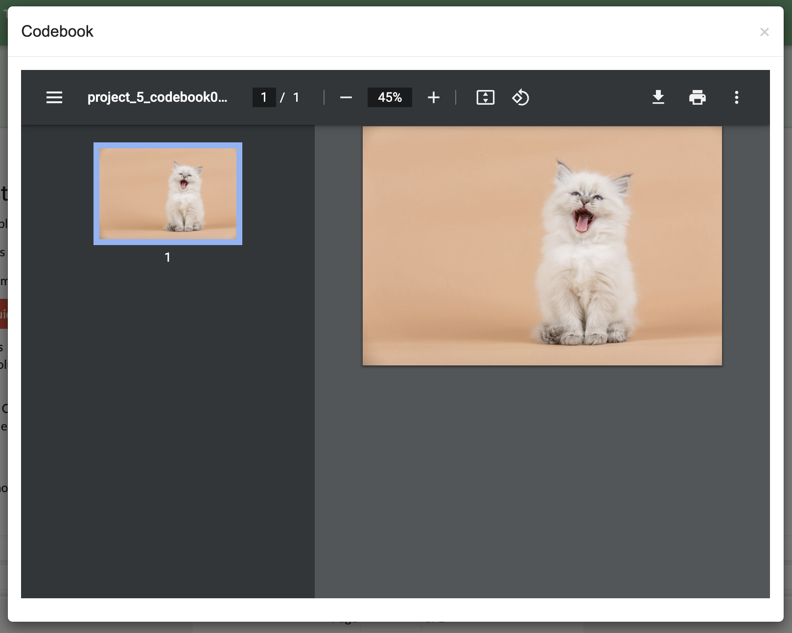
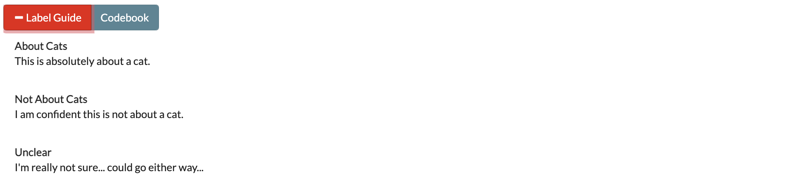

Part 4: Annotating Data
=======================

Once your project has been created, you are ready to start labeling your data! To begin, you can navigate to any project Annotation page from the :ref:`Projects Page <projects>` or to a specific Annotation page by pressing the "Annotate" link on the top navigation bar when on a project :ref:`details` or :ref:`Admin Dashboard <admindashboard>` page.

The Annotate page consists of either two or five tabs, depending on your permission User. The sections below are marked by either ADMIN (available only to those with admin privileges) or ALL (available to everyone with at least coder privileges).

.. note::

	If a user with admin privileges is on the annotation page, then other admin will be unable to access admin-only tabs until the first admin has left the page. This is to prevent multiple admin from labeling the same data simultaneously. Coders and Admin can always access the Annotate Data and History pages. See :ref:`user-roles <userroles>` for a chart of user permissions.

In addition, each tab has access to the project's :ref:`labelguide` and :ref:`codebook` using the buttons shown below:

|annotate-labelguidebuttons|

.. _annotationpage:

Annotate Data Page
------------------

**User: ALL**

The Annotate Data tab is where most users will spend a majority of their time. When you enter this page, SMART will pass you a portion of the current batch as a deck of "cards", to be presented to you one at a time. You can then choose one of two actions:

* *label*: Assign a label to the piece of data by clicking on the button corresponding to the desired label. If the data is not being used for :ref:`irr`, then this data will be marked as labeled and removed from the pool of unlabeled data. If data is IRR, then it may still be presented to additional coders on the project, but will not be presented to you again.
* *skip*: Skip the data. This option is used when you are unsure of what label to choose. Skipped data that is not IRR is sent to the Admin Annotation page to be reviewed by any user with admin privileges.

|annotate-cards|

.. _batchrefilling:

Refilling the Batch
~~~~~~~~~~~~~~~~~~~

A user's card deck will continue to refill itself from the batch until it is empty. Once a batch has been coded or skipped, a new batch of unlabeled data will be requested from SMART. This batch will be selected using the chosen active learning algorithm, or randomly, depending on if Active Learning was enabled in :ref:`advancedsettings`. The batch may also be selected randomly for three other reasons:

* It is the first batch
* Each possible label has not been used at least once
* There has not been a full batch worth of data marked as labeled (possibly some was skipped or is IRR and waiting for additional labels)

If a model is currently running, then this batch will be delayed until the model has finished running, and you will be presented with the message in the image below. Note that this does not apply to projects that have disabled having a model. Projects that have disabled Active Learning but have a model will still have to wait for the model to run, but it will be done faster as predictions will not have to be generated for the unlabeled data (see :ref:`admindashboard` for more details).

|annotate-nocards|

.. Tip::

   If you are seeing the message above, try refreshing the page. The batch might have become available after the application was last queried. If the message is still there, then wait a few minutes for the model to finish and refresh again.

.. _history:

History Page
------------

**User: ALL**

Perhaps you have been happily coding your data and you accidentally click the wrong label. Now you have data labeled "hotdog" which is decidedly *not about hotdogs!* Or perhaps you have labeled a number of items when your project leader announces that from this day forth, *chedderwursts will also be counted as hotdogs!* The history tab exists for scenarios like these ones. In this tab, you are able to view and edit your past labels. This page includes all data that has been labeled by you personally, and provides the text, past label, and date/time of the most recent label.

The history table is automatically sorted by the date to provide the most recent labels first [see :ref:`searchingandsorting`].

|annotate-history-page|

To save space, the history table only includes enough text for each data sample to fit the page width. To expand a row for reading and editing, click on the arrow to the left of the text. This will open up a subrow with the entire text and the label/skip options. Note that changing a label to skip will remove it from the history table as you have effectively given up responsibility for it.

|annotate-history-expanded|

.. Note::

	:ref:`irr` data labels can be changed in the history table up until the point where enough people have labeled/skipped it and it is processed. At this point, the data is effectively "labeled by everyone" (either from consensus or from an admin resolving a dispute) and will no longer be editable on anyone's history table. Expanding a resolved IRR datum will simply show a message (see below):

|annotate-history-irrmessage|

.. Warning::

  *For Active Learning Users:* Active learning algorithms use past labeled data to select future batches. Data labels changed retroactively will appear in the training data for the next batch, but will not effect past batches or the current batch. Excessive amounts of label changing may confuse active learning algorithms and make them less effective (see :ref:`active-learning` for more details)

.. _fixskew:

Fix Skew Page
-------------

**User: ADMIN**

Suppose your project not only includes the labels "hot dog" and "not hotdog", but also "hamburger" (since hamburgers are the natural partner of hotdogs and therefore a separate category). The only problem is that hamburgers are fairly rare in your data, and nobody has seen one yet! You know your classifier won't even run until a hamburger has been found (see :ref:`batchrefilling`), but you are worried that waiting for random selection to find a hamburger might take a while. The "Fix Skew" page exists for this scenario. In this tab, users with admin privileges may search unlabeled data directly for examples of rare labels. The graph on the right side of the page shows the current counts for each label (see image below).

|annotate-fixskew-page|

To fix a skew, follow these steps:

1. Use the search bar below "Unlabeled Data" to search the data for keywords [see :ref:`searchingandsorting` for more information].
2. Click on the arrow to the left of the row to expand
3. Assign a label to the data

|annotate-fixskew-fixhamburger|

Once data has been labeled, the graph at the top will show the change in label counts:

|annotate-fixskew-chartafterfix|

.. Warning::

	 The Fix Skew tab should *NOT* be used in place of the Annotate Data tab. The Fix Skew tab does not use :ref:`irr`, or allow the option of skipping data. Excessive use of this page can also undermine the effects of Active Learning, or introduce unintended bias (since the data is chosen consciously by the user).

.. _adminannotate:

Admin Annotation Page
---------------------

**User: ADMIN**

The Admin Annotation page lets users with admin User privileges resolve ambiguous data. There are two types of ambiguous data that could end up in this table.

1. Normal (not :ref:`irr`) data that was skipped
2. :ref:`irr` data that has been annotated/skipped by enough people, where there was either a disagreement between the assigned labels, or at least one coder skipped it (this counts as a disagreement).

.. Tip::

   Coders are not given any indication of which data is being used for IRR. If you are using IRR in your project, and cannot find a specific skipped datum in the admin table, it may be IRR data that has not been seen by enough people yet.

The Admin Annotation tab is marked with badges showing the total number of unaddressed items. For a project that uses IRR, it will look like the tab in the image below with two sections:

|annotate-adminannotation-irrbadge|

Projects that do not utilize IRR will only show the Skipped count:

|annotate-adminannotation-noirrbadge|

The Admin Annotation page consists of a table with two columns. The first shows the reason data ended up in the table (IRR or skipped). The second gives the text for the data and provides options for how the data should be processed. The admin has two options for any data in this table:

* *label*: By clicking on one of the label buttons, the data is assigned the selected label and becomes part of the training set. If this data was skipped, then it will also become available in the admin's :ref:`history` if they want to change it later. If the data is IRR, it will also appear in their history table, but will **NOT** be editable by any user.
* *discard*: This option exists for data that is simply un-codable and should not be included in the project. Clicking this option will remove the data from any IRR records, the :ref:`fixskew`, and any consideration for future batches. (Note that the data can be restored on the :ref:`recyclebin`).

|annotate-adminannotation|

.. _recyclebin:

Recycle Bin Page
----------------

**User: ADMIN**

The Recycle Bin page acts much like a recycle bin or trash folder for most computers. Any data that was discarded in the :ref:`adminannotate` will appear on this page:

.. tip::

		You can search the Recycle Bin table for specific data [see :ref:`searchingandsorting`]

|annotate-recyclebin-page|

Data in the table will only be shown up to the width of the page to maximize the number of rows shown on the screen. To expand data, click the arrow on the left of the row. This will open a subrow with the entire text and a "Restore" button. Clicking on this button will remove the data from the Recycle Bin and place it back in the pool of unlabeled data for consideration.

|annotate-recyclebin-restore|

.. note::

   Restoring data will *not* restore any past records for this data. If data was marked for :ref:`irr`, was discarded from the admin table, and then restored, any past labels or skips will not be restored with it and the data will not be marked for IRR unless it is chosen again later.

.. _labelguide:

Label Guide (feature)
---------------------

**User: ALL**

The label guide contains the list of possible labels and their descriptions as set by the project creator or updater. This guide is placed on every tab of the :ref:`annotationpage` page for the user's convenience. To open the tab, click on the green ``+ Label Guide`` button (see :ref:`annotationpage`). The button will turn red with a minus sign as long as the guide is open (as shown below). To close, click the button again.

|annotate-openlabelguide|

.. _codebook:

Codebook (feature)
------------------

**User: ALL**

When creating or updating a project, a creator or admin has the option to add a codebook (see :ref:`addcodebook`). If a codebook has been uploaded, then in addition to the :ref:`labelguide`, a codebook button will be available on each tab of the :ref:`annotationpage` page. To open, click the ``codebook`` button. This will open a pdf viewer on the application with the file. To close, either click the ``x`` in the top right corner of the popup, or click anywhere on the screen outside of the codebook.

|annotate-codebook|

.. Warning::

	This feature makes use of the browser's built in pdf viewer. For most modern browsers like Firefox, Chrome, or Safari, this viewer will include a print or download button. However, if you are using an outdated browser, this might not be available.

.. _searchingandsorting:

Searching and Sorting (feature)
-------------------------------

**User: ALL**

You can sort any table on an annotation page by a desired column by clicking on the column header.

One click will sort it in ascending order (indicated by a grey bar at the top of the column name).

|annotate-searchandsort-ascending|

A second click will sort it in descending order (indicated by the grey bar below the text).

|annotate-searchandsort-descending|

The tables on the :ref:`history`, :ref:`fixskew`, and :ref:`recyclebin` can be filtered using the text boxes under each column header. When text is entered in one of these boxes, only the rows containing the entered text will be displayed.

|annotate-searchandsort-search|

.. |annotate-cards| image:: ./nstatic/img/smart-annotate-annotatedata-cards.png
.. |annotate-nocards| image:: ./nstatic/img/smart-annotate-annotatedata-nocards.png

.. |annotate-history-expanded| image:: ./nstatic/img/smart-annotate-history-expanded.png
.. |annotate-history-page| image:: ./nstatic/img/smart-annotate-history-page.png

.. |annotate-fixskew-page| image:: ./nstatic/img/smart-annotate-fixskew-page.png

.. |annotate-fixskew-chartafterfix| image:: ./nstatic/img/smart-annotate-fixskew-chartafterfix.png

.. |annotate-adminannotation-noirrbadge| image:: ./nstatic/img/smart-annotate-adminannotation-noirrbadge.png
.. |annotate-adminannotation-irrbadge| image:: ./nstatic/img/smart-annotate-adminannotation-irrbadge.png

.. |annotate-recyclebin-page| image:: ./nstatic/img/smart-annotate-recyclebin-page.png
.. |annotate-recyclebin-restore| image:: ./nstatic/img/smart-annotate-recyclebin-restore.png

.. |annotate-searchandsort-search| image:: ./nstatic/img/smart-annotate-searchandsort-search.png
.. |annotate-searchandsort-ascending| image:: ./nstatic/img/smart-annotate-searchandsort-ascending.png
.. |annotate-searchandsort-descending| image:: ./nstatic/img/smart-annotate-searchandsort-descending.png
