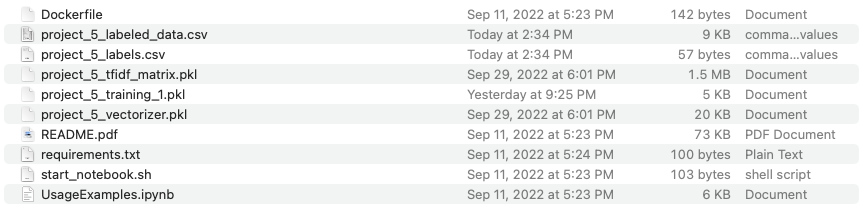
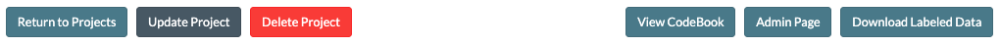
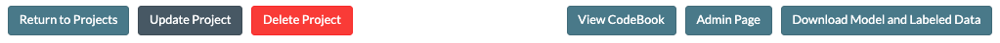
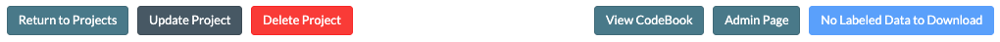
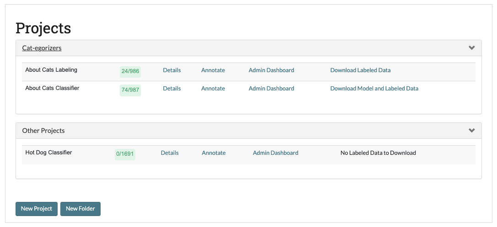
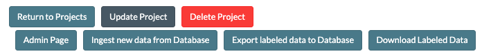

.. _downloadmodel:

Part 6: Downloading Labeled Data and/or Model
==============================================

So you have been working hard labeling your data and have accumulated a respectable amount. How do you get the data out of the application and onto your computer? SMART provides a download function that works one of three ways depending on the state and settings of your project:

1. If your project has no data labeled, then the download button does nothing and will display "No Labeled Data to Download".
2. If your project is not using a model or the requirements for a model to run have not yet been met (see :ref:`batchrefilling`), then the download button will display "Download Labeled Data" and output a comma separated value (.csv) file of the labeled data with the columns ``ID`` (for the unique ID of the data), ``Text``, and ``Label``. The data is sorted by ``Label``.
3. If your project has a model, then the download button will display "Download Model and Labeled Data". This will output a zip file with:

	a. The labeled data file (see number 2)
	b. A csv with the labels and their internal ID's assigned by the application
	c. A pickle (.pkl) file with the preprocessed version of your input data as a TFIDF matrix
	d. A pickle file with the trained classifier model
	e. A pickle file with the trained Vectorizer used to preprocess data into the TFIDF format
	f. A README with detailed descriptions of the files and sample code on how to preprocess new data and predict it with your trained model.
	g. A Dockerfile which can be used to setup an environment similar to that of the application.
	h. A script to startup a jupyter notebook server. Not meant to be run outside of the docker container.
	i. A Jupyter Notebook which demonstrates usage of the files and model (see section 4 of the README).

	 |annotate-downloadmodel-files|

This button is available in one of two places.

* The Projects Page:

|annotate-downloadmodel-projectsview|

* The bottom of the :ref:`details`:

|annotate-downloadmodel-nodatabutton|
OR (if you have labeled data but no model)
|annotate-downloadmodel-databutton|
OR (if you have the same project above with a database connection set up)
|annotate-downloadmodel-exportimportdatabutton|
OR (if you have labeled data and a model)
|annotate-downloadmodel-modelanddatabutton|

