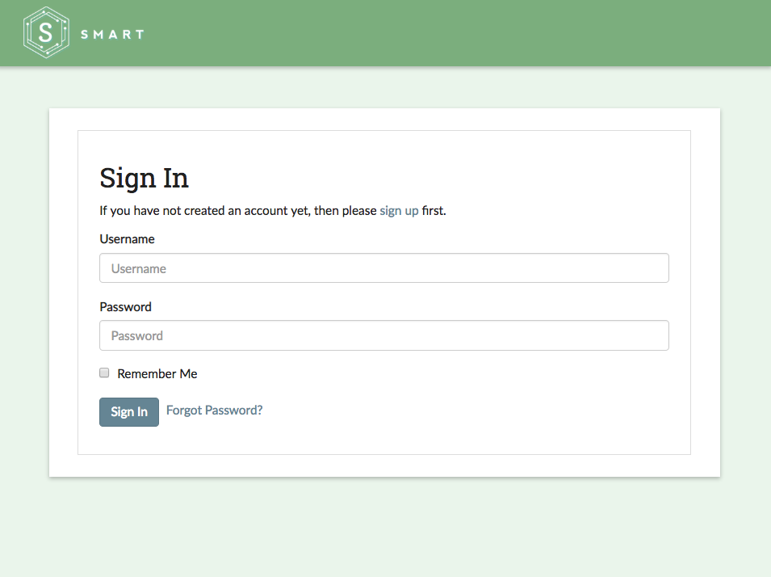
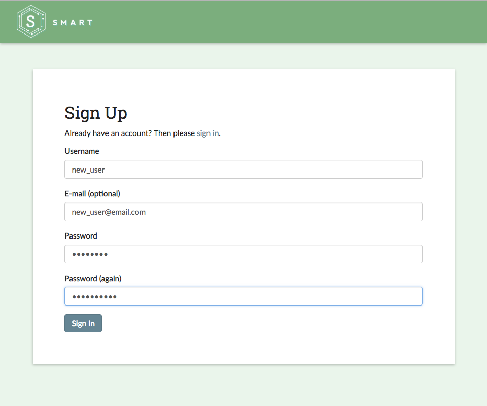

Part 1: Installation
====================

.. note::
	Additional installation instructions and developer notes are available at the `SMART Github code repository <https://github.com/RTIInternational/SMART>`_.

To begin installing SMART, first clone the code repository to the local directory of your choice:

::

	$ git clone https://github.com/RTIInternational/SMART.git

SMART uses Docker in development to aid in dependency management. First, install `Docker <https://www.docker.com/>`_ and `Docker Compose <https://docs.docker.com/compose/install/>`_. Then navigate to ``envs/dev`` and run ``docker-compose build`` to build all the images:

::

	$ cd smart/envs/dev
	$ docker-compose build

Next, create the docker volumes where persistent data will be stored: ``docker volume create --name=vol_smart_pgdata`` and ``docker volume create --name=vol_smart_data``.

::

	$ docker volume create --name=vol_smart_pgdata
	$ docker volume create --name=vol_smart_data

Then, setup the database and ensure the correct table/schema is prepared for the application

::

  $ docker-compose run --rm smart_backend ./migrate.sh

Lastly, run ``docker-compose up`` to start all docker containers.  This will start up the containers in the foreground so you can see the logs.  If you prefer to run the containers in the background use ``docker-compose up -d``. When switching between branches there is no need to run any additional commands (except build if there is dependency change).

::

	$ docker compose up -d

To see SMART in action, navigate to http://localhost:8000 in your web browser of choice.  You should be welcomed by the SMART login screen:

|login-screen|

.. note::

	By default, SMART will use port 8000 for the front-end and port 5432 for the back-end processes. See the SMART code repository README for instructions on how to change the default ports.

Finally, create a profile to start your own new labelling projects or to be added to an existing one:

|sign-up|

