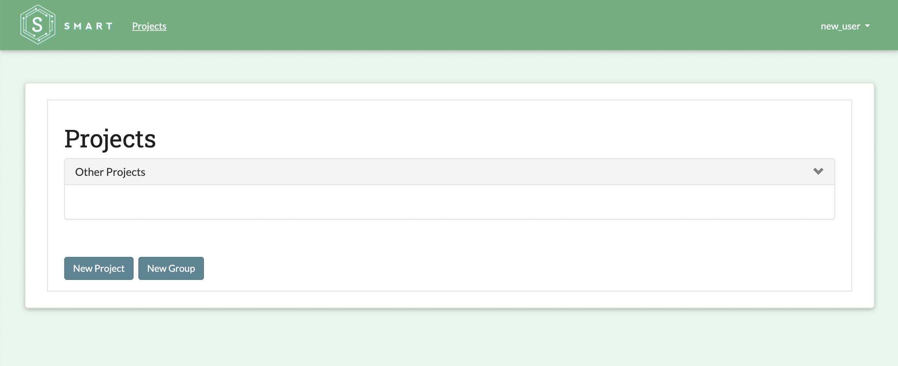
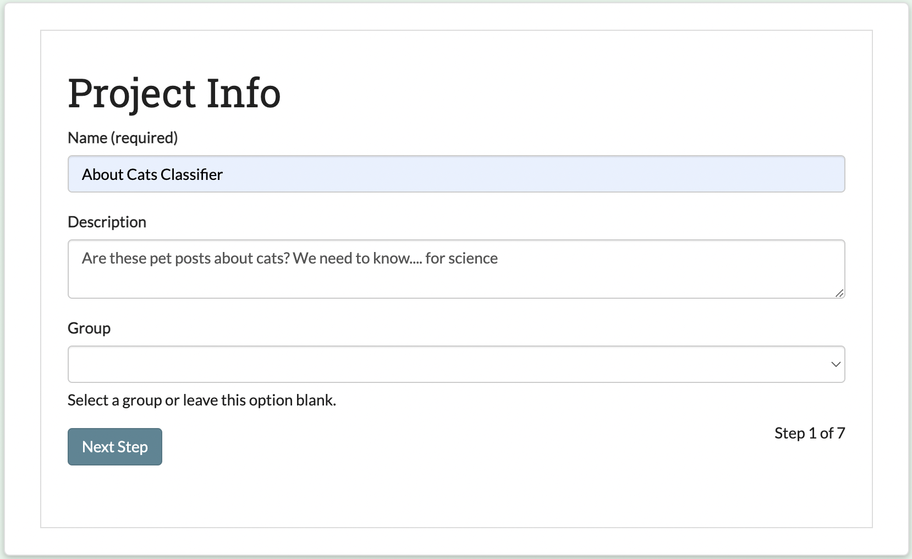

.. _create-new-project:

Part 2: Creating a New Project
==============================

Starting a new labelling project in SMART is as easy as pressing the "New Project" button on the SMART landing page. All users have the ability to start their own coding projects, though they may be restricted to modifying or deleting existing projects depending on their user roles.

For new users without any existing projects, the SMART landing page should look like this:

|project-start|

For the purpose of this tutorial, we'll create a project to classify tweets as being either *Hotdog* or *Not Hotdog* related (hat tip to HBO's Silicon Valley). This project is called the "Not Hotdog" Classifier.

Project Description
-------------------

The first step in creating your project is to provide a project name and description.  The name will be the internal reference for the project which users will see on their landing pages and the description will be available for users on the project Details page.  Below, we fill out the name and description for our "Not Hotdog" classifier:

|project-info|

.. _labels:

Creating Label Definitions
--------------------------

In the Labels section, we will create categories for labeling. These labeled observations will be used to train a classification model that predicts what category (*Hotdog* or *Not Hotdog*) a new observation belongs. To add new categories, just fill-in the names of the categories you're interested in predicting into the input boxes. If you have more than two labels, use the "add label" link to add more rows to the form. If you decide that you want to remove a label after adding it, use the "remove label" link to remove the label name.

|project-labels|

.. note::

	* SMART requires at least two category labels and the labels must be unique.
	* If you plan on uploading a data file that contains labels, the label categories in the file must match those provided on this page.
	* You may add up to 10,000 labels to each project.

.. warning::
	* You cannot add, remove, or update any labels for a project after the project is created.

Project Permissions
-------------------

To help organize your labeling projects, you can assign special permissions to other project members. Project members can be assigned one of two user-roles:

* **Admins** are able to update the project description, upload additional data, control project permissions, and annotate data.
* **Coders** are able to view project details and annotate data.

In this panel, you can select project members and assign their role types. Clicking the "add permissions" link adds more rows to the form. If you decide that you want to remove a permission after adding it, click the "remove permission" link next to the inputs to remove the permission. If an intended project member is not listed below, please check to see if they have created an account.

In the development environment, SMART includes three user profiles for testing purposes (``root``, ``tom``, and ``jade``). Inviting additional users to a project is optional. For the purposes of this tutorial, we will add ``tom`` as a coder:

|project-permissions|

.. note::

	* The project creator is always assigned Admin privileges.
	* Each user profile can only be assigned one permission type.
	* Each row must be completely filled in with both a profile and permission.
	* You can update permissions after creating a project.

.. _advancedsettings:

Advanced Settings
-----------------

The Advanced Settings page allows you to customize your labelling experience and utilize advanced features such as :ref:`active-learning` or :ref:`irr`. For the tutorial, we'll keep the default settings, but please reference the :doc:`features` section of the documentation to learn more about these and other options.

|project-adv-set|

.. _addcodebook:

Adding Codebook
---------------

This page gives you the opportunity to upload extra information for coders that maybe be helpful for clarifying the labelling task (ex: tips for differentiating categories, examples of labeled data, etc.). This is particularly useful if the categories you're interested in labelling are numerous or nuanced.

A demo codebook for the tutorial can be found in the ``smart/demo/`` directory. To upload the codebook, click the "Choose File" button and select ``hotdog-codebook.pdf``:

|project-codebook|

.. note::

	The codebook file must be a PDF.

Upload Data
-----------

Time to upload your data!

To upload, the data file must pass the following checks:

* The file needs to have either a .csv, .tsv, or .xlsx file extension.
* The file requires the data to be formatted into two columns, with header names ``Text`` and ``Label`` OR three columns with header names ``ID``, ``Text``, and ``Label``.
* The largest file size supported is 4GBs.
* The (optional) ID column should contain a unique identifier for your data. The identifiers should be no more than 128 characters.

The ``Text`` column should contain the text you wish users to label. For our "Not Hotdog" classifier, the ``Text`` column would contain the tweet text.

The ``Label`` column should contain any pre-existing labels for the corresponding text. If none of your data contains existing labels, then this column can be left blank. Extending our example, if a lead coder has already annotated some tweets as *Hotdog* or *Not Hotdog*, this column would contain those labeled records.

The data used in this tutorial is shipped with SMART and can be found in the ``smart/demo/`` directory. To upload this file, click the "Choose File" button and select ``hotdog-example.csv``:

|project-dataup|

.. tip::

	* SMART will keep up to two million unique records per data set.
	* If there are multiple rows with the same text, only one of the records will be saved.
	* You may add a dataset that already contains labelled observations. However, all labels present in the upload file must be in list of categories assigned in the :ref:`labels` step.

.. |project-labels| image:: ./nstatic/img/smart-newproject-labels.png
.. |project-permissions| image:: ./nstatic/img/smart-newproject-permissions.png
.. |project-adv-set| image:: ./nstatic/img/smart-newproject-adv-settings.png

.. |project-dataup| image:: ./nstatic/img/smart-newproject-dataup.png
