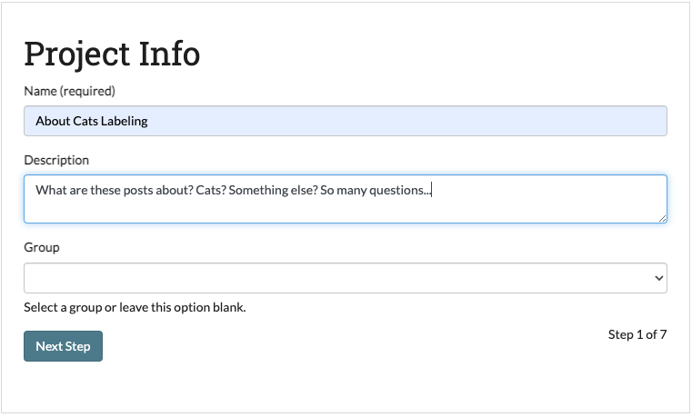
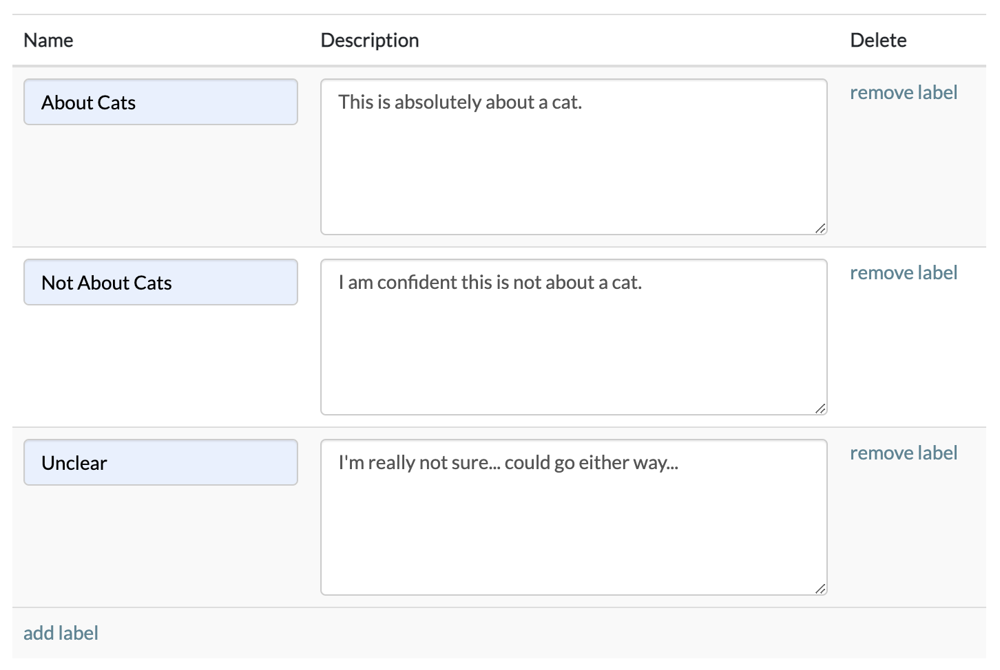
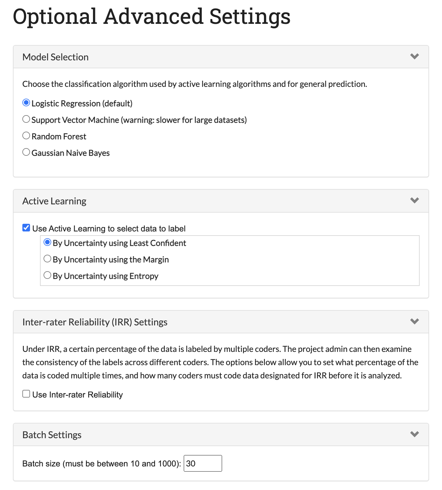
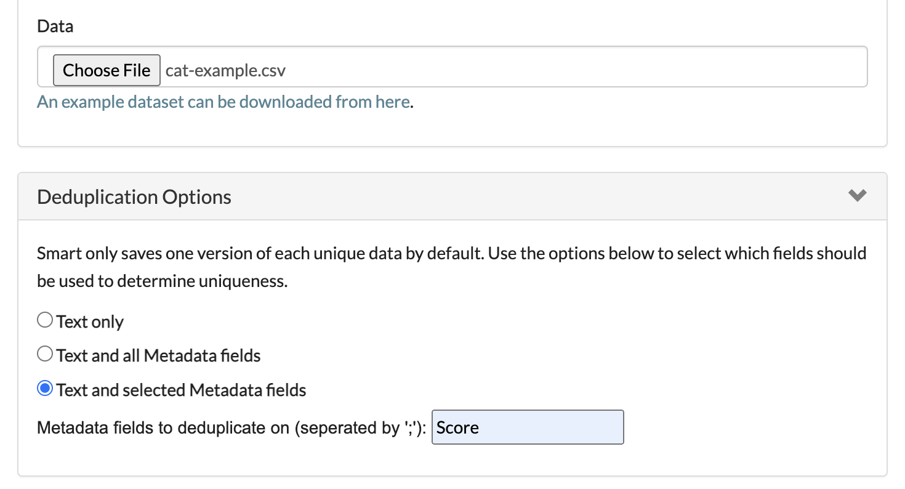

.. _create-new-project:

Part 2: Creating a New Project
==============================

Starting a new labelling project in SMART is as easy as pressing the "New Project" button on the SMART landing page. All users have the ability to start their own coding projects, though they may be restricted to modifying or deleting existing projects depending on their user roles.

For new users without any existing projects, the SMART landing page should look like this:

|project-start|

For the purpose of this tutorial, we'll create some projects to classify Reddit posts to see if they are about cats. 
Below we'll give instructions on how to create a classifier project and a general labeling project where we do not want to use a classifier.

Project Groups \[NEW\]
----------------------

As of SMART 3.0.0, projects can now be grouped. By default any project not assigned a group will be put in the "Other Projects" group. 
Project groups can only be created and assigned once at least one project exists, so currently if the "New Group" button is pressed you should see the following page.

|project-groups-noproject|

For instructions on how to use project groups see :ref:`Project Groups<projectgroups>`

Project Description
-------------------

The first step in creating your project is to provide a project name and description.  The name will be the internal reference for the project which users will see on their landing pages and the description will be available for users on the project Details page.  
Below, we fill out the name and description for our "About Cats Classifier" project which will use the modeling features to classify posts in one of three ways, and our "About Cats Labeling" project which will classify posts in many ways and not use a classifier:

|project-info-classifier|

|project-info-nonclassifier|

.. _labels:

Creating Label Definitions
--------------------------

In the Labels section, we will create categories for labeling. These labeled observations can then be used to train a classification model that predicts what category a new observation belongs. To add new categories, just fill-in the names of the categories you're interested in predicting into the input boxes. 
If you have more than two labels, use the "add label" link to add more rows to the form. 
If you decide that you want to remove a label after adding it, use the "remove label" link to remove the label name.

You can also upload a file with labels and descriptions by clicking the "Choose File" button.

.. note::

	* SMART requires at least two category labels and the labels must be unique.
	* If you plan on uploading a data file that contains labels, the label categories in the file must match those provided on this page.
	* You may add up to 10,000 labels to each project.
	* Label files must contain ``Label`` and ``Description`` columns.
	* The label file must be a CSV (comma separated values) file.

.. warning::
	* You cannot add, remove, or update any labels for a project after the project is created.

For our first project "About Cats Classifier" we only have three labels which we want SMART to predict, so we fill them in below:

|project-labels-classifier|

For our second project "About Cats Labeling" we have many more labels, which we will fill in using a file.

|project-labels-nonclassifier|

Project Permissions
-------------------

To help organize your labeling projects, you can assign special permissions to other project members. Project members can be assigned one of two user-roles:

* **Admins** are able to update the project description, upload additional data, control project permissions, and annotate data.
* **Coders** are able to view project details and annotate data.

In this panel, you can select project members and assign their role types. Clicking the "add permissions" link adds more rows to the form. If you decide that you want to remove a permission after adding it, click the "remove permission" link next to the inputs to remove the permission. If an intended project member is not listed below, please check to see if they have created an account.

In the development environment, SMART includes three user profiles for testing purposes (``root``, ``user1``, and ``test_user``). Inviting additional users to a project is optional. For the purposes of this tutorial, we will add ``user1`` as a coder for both projects:

|project-permissions|

.. note::

	* The project creator is always assigned Admin privileges.
	* Each user profile can only be assigned one permission type.
	* Each row must be completely filled in with both a profile and permission.
	* You can update permissions after creating a project.

.. _addcodebook:

Adding Codebook
---------------

This page gives you the opportunity to upload extra information for coders that maybe be helpful for clarifying the labelling task (ex: tips for differentiating categories, examples of labeled data, etc.). This is particularly useful if the categories you're interested in labelling are numerous or nuanced.

A demo codebook for the tutorial can be found in the ``smart/demo/`` directory, which we will be using for both projects. To upload the codebook, click the "Choose File" button and select ``cat-codebook.pdf``:

|project-codebook|

.. note::

	The codebook file must be a PDF.

.. _setupdatabase:

Setup Database Connection (optional) \[NEW\]
--------------------------------------------

New in SMART 3.0.0, this page lets you connect SMART to an MSSQL database. This lets you provide a table in the database that you want SMART to pull from when adding data to the project. You may also name a new table which SMART will export labeled data to. SMART will error if the export table already exists.

.. note::

	A database connection can be set up or removed any time after the project has been created by going to the :ref:`update` page.

Below is an example of setting up a database connection, for our Cat projects, we will not be setting up a connection.

|project-database-connection|

Upload Data
-----------

Time to upload your data!

SMART now provides two options for uploading data. If you have set up a database connection in the previous step, you can select 
"Connect to Database and Import Table" to import your data from the ingest table you indicated in the Database Connection page. Otherwise, select "File Upload" to upload a data file to SMART.

To upload, the data must pass the following checks:

* If choosing file upload, the file needs to have either a .csv, .tsv, or .xlsx file extension.
* The file or datatable requires the data to have one column named ``Text``. It can also contain a unique id column named ``ID`` and a label column named ``Label``.
* The largest file size supported is 500MBs.
* The (optional) ``ID`` column should contain a unique identifier for your data. The identifiers should be no more than 128 characters.
* You may add a dataset that already contains labelled observations. However, all labels present in the upload file must be in list of categories assigned in the :ref:`labels` step.

The ``Text`` column should contain the text you wish users to label. For our "About Cats" projects, the ``Text`` column will contain the post text.
The ``Label`` column should contain any pre-existing labels for the corresponding text. If none of your data contains existing labels, then this column can be left blank or removed. Extending our example, if a lead coder has already annotated some posts with their cat outcomes, this column would contain those labeled records.

.. _projectmetadata:

**Project Metadata \[NEW\]**
----------------------------

Any fields outside of ``Text``, ``Label``, or ``ID`` will be classified as "metadata," also called "respondent data." This is additional data which you would like to be presented along with the text to aid in labeling. 

Some details about metadata:

* Metadata fields can have nulls
* If you upload a file or pull in a table with metadata fields in project creation, SMART will expect all future data uploads to have those fields 
* SMART will disregard metadata fields in files uploaded after project creation if they did not exist in the first project creation upload.
* Metadata fields can be used in SMART for deduplication. In the example below, the "Score" metadata field has been selected for deduplication. This means that if two posts have the same text but different scores, they will be considered distinct entities for coding by SMART.

|project-dataup|

.. tip::

	* SMART will keep up to two million unique records per data set.
	* If there are multiple rows with the same text and deduplicating metadata (see above), only one of the records will be saved, and the first label, if given, will be saved.

.. _advancedsettings:

Advanced Settings
-----------------

The Advanced Settings page allows you to customize your labelling experience and utilize advanced features such as :ref:`active-learning` or :ref:`irr`. 

Please reference the :doc:`features` section of the documentation to learn more about these and other options.

For our first project "About Cats Classifier" we will turn on the model selection and active learning, but leave out Inter-Rater Reliability. 

|project-adv-set-classifier|

For our second project "About Cats Labeling" we will want to go with the default settings for Model Selection and Active learning. We will turn on Inter-Rater-Reliability and set it to 50% (so half of our posts will be double coded).

|project-adv-set-nonclassifier|

.. note::
	* You may be wondering... "Can I make a project with both a classifier and a large number of labels?" The answer is yes, SMART will let you do that. However, the Active Learning and model portions of SMART only turn on when it deems you have randomly labeled **at least one of each possible label**, and even then it will likely not be very accurate until it has a representative sample of each label. So the more labels you have... the more you have to label! This is why we don't reccomend enableing the classifier option in SMART for projects with more than 5 labels.

.. tip::

	The data used in this tutorial is shipped with SMART and can be found in the ``smart/demo/`` directory. To upload this file, click the "Choose File" button and select ``cat-example.csv``:

.. |project-start| image:: ./nstatic/img/smart-newproject-start.png
.. |project-info-classifier| image:: ./nstatic/img/smart-newproject-info.png

.. |project-permissions| image:: ./nstatic/img/smart-newproject-permissions.png

.. |project-codebook| image:: ./nstatic/img/smart-newproject-codebook.png

