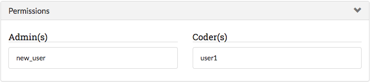
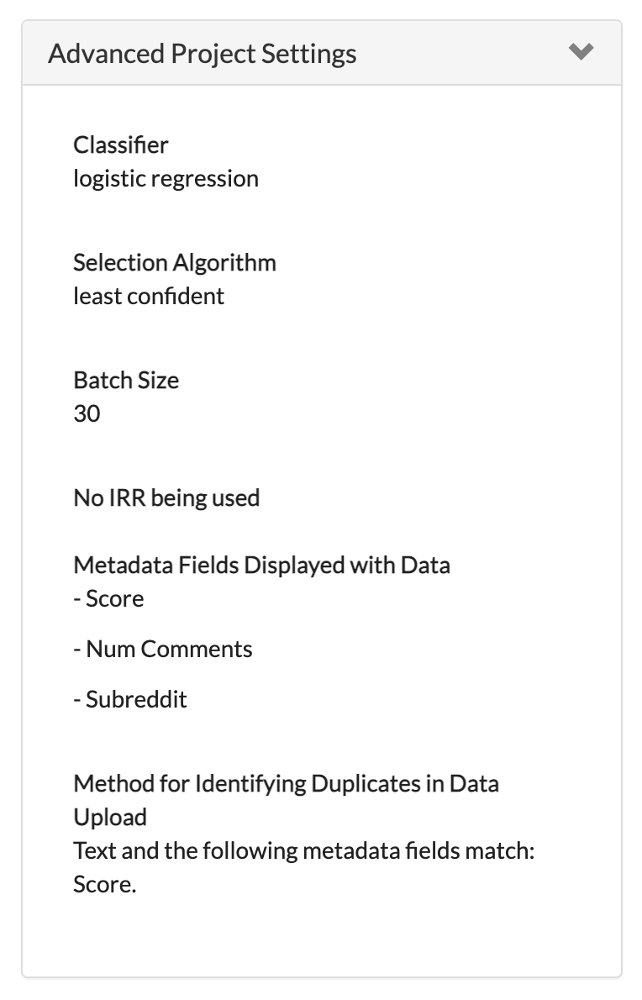

Part 3: Reviewing Projects & Editing Project Settings
=====================================================

.. _projects:

Projects Page
-------------

The projects page serves as the central page for a SMART user. The page provides a list of all projects the user is on, and provides links to major parts of each project. Users with admin privileges will be able to see links to a project's respective :ref:`Admin Dashboard<admindashboard>` as well as the :ref:`Download Labeled Data and/or Model<downloadmodel>` button. Coders will only see the :ref:`details` and :ref:`annotationpage` links. This is also the page where you go to :ref:`Create a New Project <create-new-project>`.

In the image below, the new user is an admin for all projects except for the ``Pepsi or Coke?`` project.

|lotsofprojects|

.. _projectgroups:

Adding a Project to a Group
---------------------------

TODO

.. _details:

Details Page
------------

The Details page provides an overview of the information and settings for your project. Each project has its own Details page, which is created when you start a new project. You can navigate to any project Details page from the :ref:`Projects Page <projects>` or to a specific Details page by pressing the "Details" link on the top navigation bar when on a project :ref:`annotationpage` page or :ref:`Admin Dashboard <admindashboard>` page.

**The Details page lets you review:**

* The project Description

|details-description|

* What permissions have been assigned to what users

|details-permissions|

* The advanced settings (i.e. :ref:`active-learning`, :ref:`irr`, classifier, batch size)

|details-advanced|

* The labels being used and their descriptions (if applicable)

|details-labels|

* A sample of your data

|details-data|

At the bottom of the Details page, there are buttons to delete the project, edit the project settings, or download the labeled data and (if applicable) trained model. These buttons are only visible to users with admin privileges for the project.
|details-buttons|

.. _update:

Updating a Project
------------------

The Update Project page is accessible from the :ref:`details` of a project. This page can be used for the following operations:

* Edit the project name and description
* Add additional data to label
* Add or change the codebook file
* Add, remove, or change project permissions
* Edit label *descriptions*

.. tip::

	* SMART allows up to two million records total. This includes additional data added later.
	* New data is checked against existing data for duplication.

Deleting a Project
------------------

The button to delete a project can be found on the :ref:`details` page of a project. To delete a project, click this button and then select "yes" at the prompt.

|delete-project|

.. |lotsofprojects| image:: ./nstatic/img/smart-reviewedit-lotsofprojects.png
.. |details-description| image:: ./nstatic/img/smart-reviewedit-detailsdescription.png

.. |details-labels| image:: ./nstatic/img/smart-reviewedit-detailslabels.png
.. |details-data| image:: ./nstatic/img/smart-reviewedit-detailsdata.png
.. |details-buttons| image:: ./nstatic/img/smart-reviewedit-detailsbuttons.png
.. |delete-project| image:: ./nstatic/img/smart-reviewedit-delete.png
