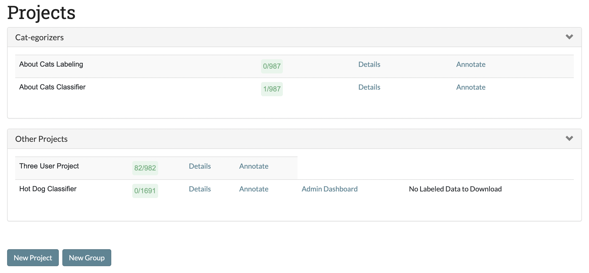

Part 3: Reviewing Projects & Editing Project Settings
=====================================================

.. _projects:

Projects Page
-------------

The projects page serves as the central page for a SMART user. The page provides a list of all projects the user is on, and provides links to major parts of each project. Users with admin privileges will be able to see links to a project's respective :ref:`Admin Dashboard<admindashboard>` as well as the :ref:`Download Labeled Data and/or Model<downloadmodel>` button. Coders will only see the :ref:`details` and :ref:`annotationpage` links. This is also the page where you go to :ref:`Create a New Project <create-new-project>`.

The projects will also give a high level count of the portion of data in the project which has been fully labeled. Note that items in the :ref:`recyclebin` will not be counted in the denominator of the fraction.

The image below is the project page for User1. We see that the user is a coder for all projects except for the ``Hot Dog Classifier`` project, where it is an Admin.

|lotsofprojects|

.. _projectgroups:

Adding a Project to a Group
---------------------------

To add a project to a group, we must first create the group and add one project to it by clicking the "New Group" button, writing the name of the group, and adding a project.

Below we add our "About Cats Classifier" project to a new group.

|projects-group|

You can add more projects to that group by clicking "New Group" and typing the same group name,
but you can also add projects to the list of existing groups through selecting that project in the project page and then going to ``Details``-> ``Update Project`` -> ``Add Project to Group``.

Below we add our "About Cats Labeling" project to the Group we made for the "About Cats Classifier" project.

|projects-update-group|

.. _details:

Details Page
------------

The Details page provides an overview of the information and settings for your project. Each project has its own Details page, which is created when you start a new project. You can navigate to any project Details page from the :ref:`Projects Page <projects>` or to a specific Details page by pressing the "Details" link on the top navigation bar when on a project :ref:`annotationpage` page or :ref:`Admin Dashboard <admindashboard>` page.

(Examples in this section are from the "About Cats Classifier" project)

**The Details page lets you review:**

* The project Description.

|details-description|

* What permissions have been assigned to what users.
* The advanced settings (i.e. :ref:`active-learning`, :ref:`irr`, classifier, batch size, :ref:`projectmetadata`, deduplication settings).

|details-advanced-permissions|

* The status of the data currently loaded in your project. This splits into:
   * *Fully Labeled*: data which has been either labeled by one user (if not IRR data) or has received the required number of labels and they either agreed or the disagreement was resolved (if IRR data).
   * *Unlabeled and Unassigned*: This data has not been touched since it was loaded into SMART.
   * *Awaiting Adjudication*: This data is sitting in the :ref:`adminannotate` table waiting review by an administrator. It was either IRR data where the coders did not agree, or the data was sent to an administrator by a coder.
   * *Recycle Bin*: This data was dropped from the project for some reason and is not included in the data totals. 
   * *Assigned/Partially Labeled IRR*: This data is in progress. Either it has been passed out to someone for coding (see :ref:`unassigncoders` on how to un-assign data from coders), or it is IRR data which has received some labels but not enough to be either adjudicated or resolved.

|details-counts|

* The labels being used and their descriptions (if applicable).

|details-labels|

* A sample of your data.

|details-data|

At the bottom of the Details page, there are buttons to delete the project, edit the project settings, or download the labeled data and (if applicable) trained model. These buttons are only visible to users with admin privileges for the project.

|details-buttons|

.. note::
	If you have set up a database connection, there will also be buttons for ingesting new data from the ingest table, and exporting labeled data to the export table. Note that the export will **completely drop and rewrite the export table every time.**

|annotate-downloadmodel-exportimportdatabutton|

When you click on the "Ingest new data from Database" button, SMART will import the ingest database table and compare it with the data already in SMART.
If there are any new items in the database which do not already exist in SMART, these will be added. SMART will return the number of new items added in a window, or if an error was thrown, the error:

|smart-ingest-nonewdata|

.. _update:

Updating a Project
------------------

The Update Project page is accessible from the :ref:`details` of a project. This page can be used for the following operations:

* Edit the project name and description.
* Add or remove an MSSQL database connection, or change settings (NOTE: you will be required to re-enter database credentials to make changes).
* Add additional data to label.
* Add or change the codebook file.
* Add, remove, or change project permissions.
* Edit label descriptions.
* Add the project to an existing group.

.. tip::

	* SMART allows up to two million records total per project. This includes additional data added later.
	* New data is checked against existing project data for duplication.

Deleting a Project
------------------

The button to delete a project can be found on the :ref:`details` page of a project. To delete a project, click this button and then select "Yes" at the prompt.

|delete-project|

.. |projects-update-group| image:: ./nstatic/img/smart-update-addtogroup.png
.. |details-description| image:: ./nstatic/img/smart-reviewedit-detailsdescription.png

.. |details-counts| image:: ./nstatic/img/smart-reviewedit-detailscounts.png
.. |details-labels| image:: ./nstatic/img/smart-reviewedit-detailslabels.png

.. |delete-project| image:: ./nstatic/img/smart-reviewedit-delete.png
.. |annotate-downloadmodel-exportimportdatabutton| image:: ./nstatic/img/smart-downloadmodel-exportimportdatabutton.png
.. |smart-ingest-nonewdata| image:: ./nstatic/img/smart-ingest-nonewdata.png
